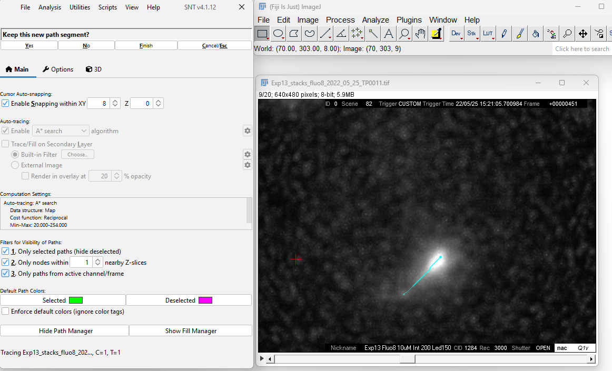
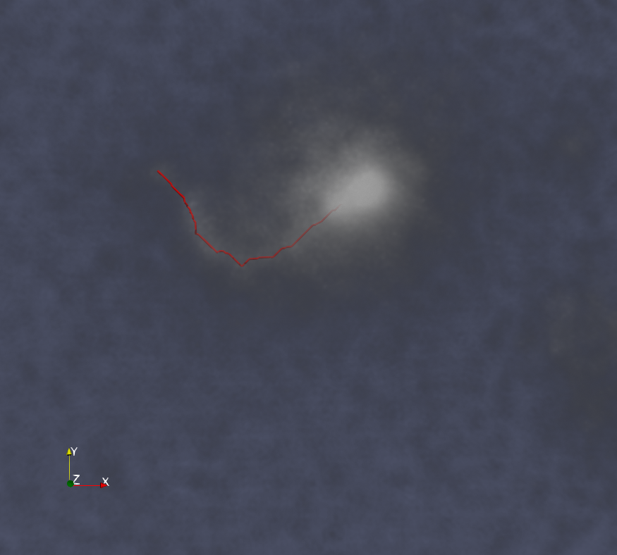
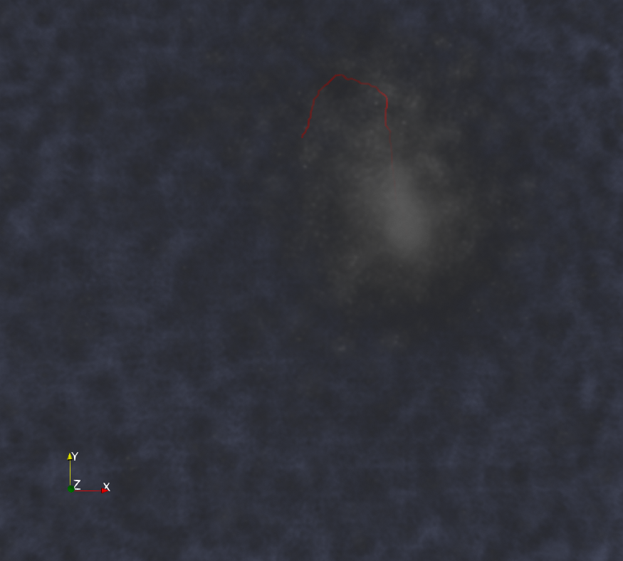
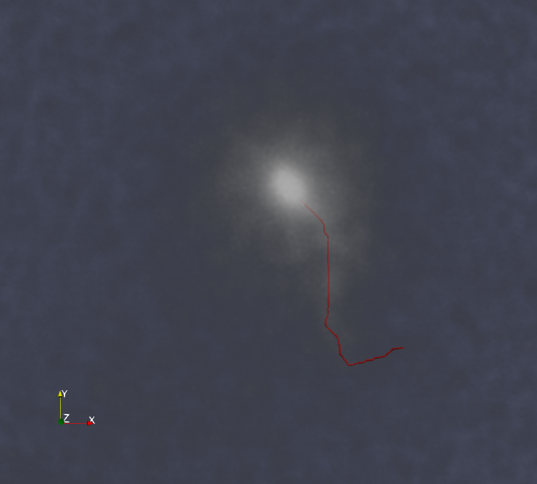

# 3D Centerline tracing of single branch tubular structures
Python implementation of the code to trace single branch tubular structures where the algorithm consist mainly of two parts. In a first step, the algorithm uses a deep learning model to segment the tubular structures, and the second step correspond to uses a minimal path algorithm to extract the center-line.

This notebook is organized as follows:
1. **Generate ground-truth data corresponding to the center-line of the tubular structures** 
	- The user have to manually/semi-manually annotate the 3D center-line for several 3D stacks. This step is neccesary because we will train a deep learning algorithm to detect tubular structures based on this annotation. 
2. **Generate training set in the formart required to train a deep learning algorithm for segmentation**
	- Training a deep learning algorithm requires the input image and the expected output. In this step, we create the dataset necessary to train the deep learning algorithm.
3. **Train a deep learning algorithm**
	- In this step we optimize the weights of a deep learning model to segment bright-tubular structures.
4. **Trace the centerline**
	- The model generated in step 3 is used to segment bright-structures in a 3D image stack, then the algorithm will employ a minimal path algorithm to extract the centerline.

# Overview

## 1. Generate ground-truth dataset
Generating ground-truth data is a necessary step to make sure that the data correspond to the expected output than an automatic algorithm must reproduce. In this project, we are interested in tracing the center-line from 3D-tubular structures. Therefore, we have to generate the 3D coordinates (x, y, and z) of the centerline. There are several tools to generate the center-line, we recommend to use the [Fiji Plugin SNT](https://imagej.net/plugins/snt/). SNT is a semi-automatic algorithm which requires the user to select two points, then the algorithm tries to find the best path connecting the two points (taking into account the brightness). Installation of the plugin is easy and instructions are found in [this link](https://imagej.net/plugins/snt/#installation).

Trace the center-line using the following steps:
1. Once SNT has been installed, you can access to it using: ***Fiji -> Plugins -> Neuroanatomy -> SNT ...***
2. In the SNT windows open a file by: ***File -> Choose Tracing image -> From File ...***
	- Navigate to the location of the 3D image to trace and open it.
	- The image must appear in the main windows of Fiji.
3. Select the initial point. The initial point should be an identifier of the position of the object, for example the tip or the center of the head. In this case, we select the sperm head's center point.
4. Select a terminal point. Select another point to create the center-line. Note:
	- If the terminal point is selected far away from the previous point, then the center-line may be traced incorrectly. Next figure: display an example of tracing the center´line between two points

||
|:--:| 
| *Figure 1: SNT tracing: Select an initial point (sperm head's center position) and select another point in the flagellum's center-line. Repeat this process until all the center-line has been traced.* |
5.	If the user is satisfied with the tracing then in the main SNT windows (left-upper corner) select "Keep this new path segment?" **Yes**.
6. Repeat step 4-5 until all the center-line has been trace. Note the algorithm obtains the center-line between the point selected in step 4 and the last point from the trace.
7. Once finished the center-line. In the main SNT windows (left-upper corner) select "Select a point further along the structure ..." **Finish**.
8. Save the trace from SNT windows using: ***File -> Save tracings -> SWC...***
	- Save the file with the same name as the input image and extension *txt*
	- The [swc format](http://www.neuronland.org/NLMorphologyConverter/MorphologyFormats/SWC/Spec.html) saved the information using a three structure. It saves the 3d coordinates of the centerline in the 4,5, and 6 columns.
9. Repeat this process for as many 3D stacks as possible.

For this notebook, I traced the center-line for 120 images (3D) and the required time was aproximately 6 hours.

||||
--- | --- | ---| 

*Figure 2. Overlay between a volume rendering from 3D image stacks and the center-line traced using SNT (red line).*

## 2. Generate training set

# Instalation
## Requirements

## Instructions
	
# Usage
## **Using Python script**
## **Using terminal**

# Example of applying the filter to an image
